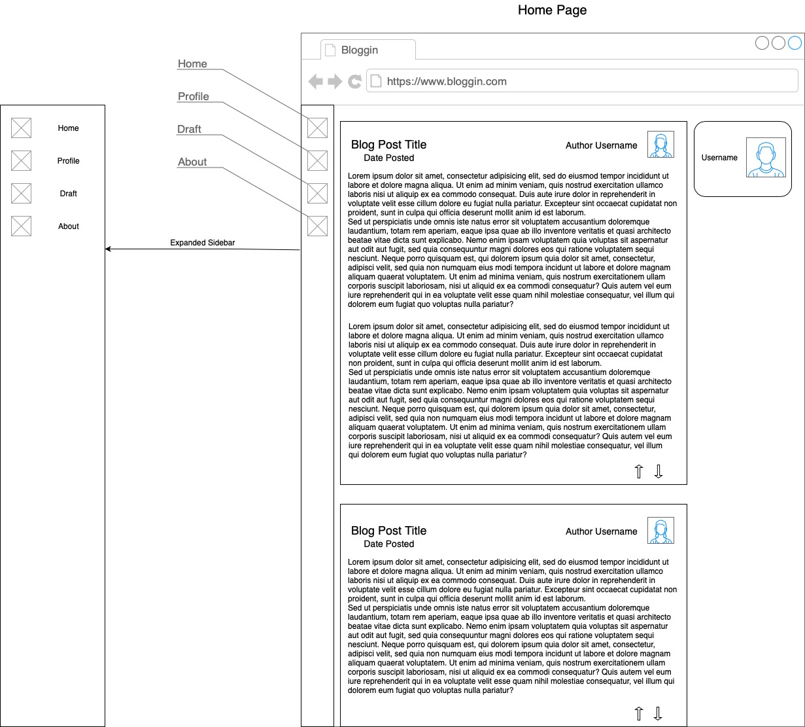
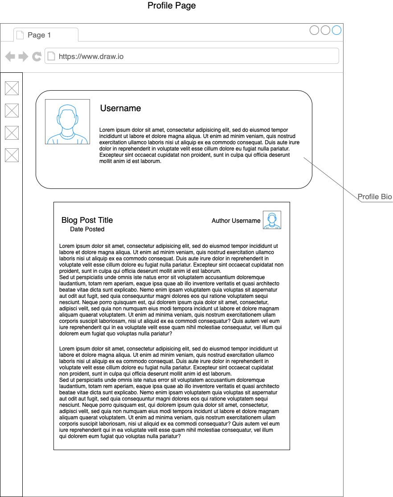
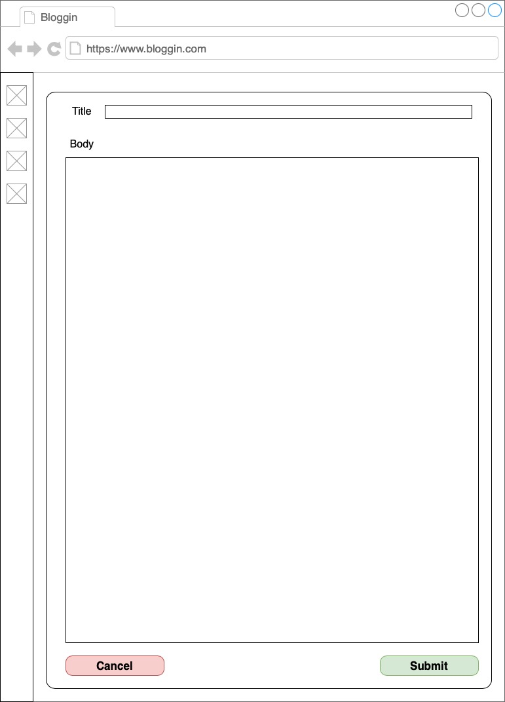
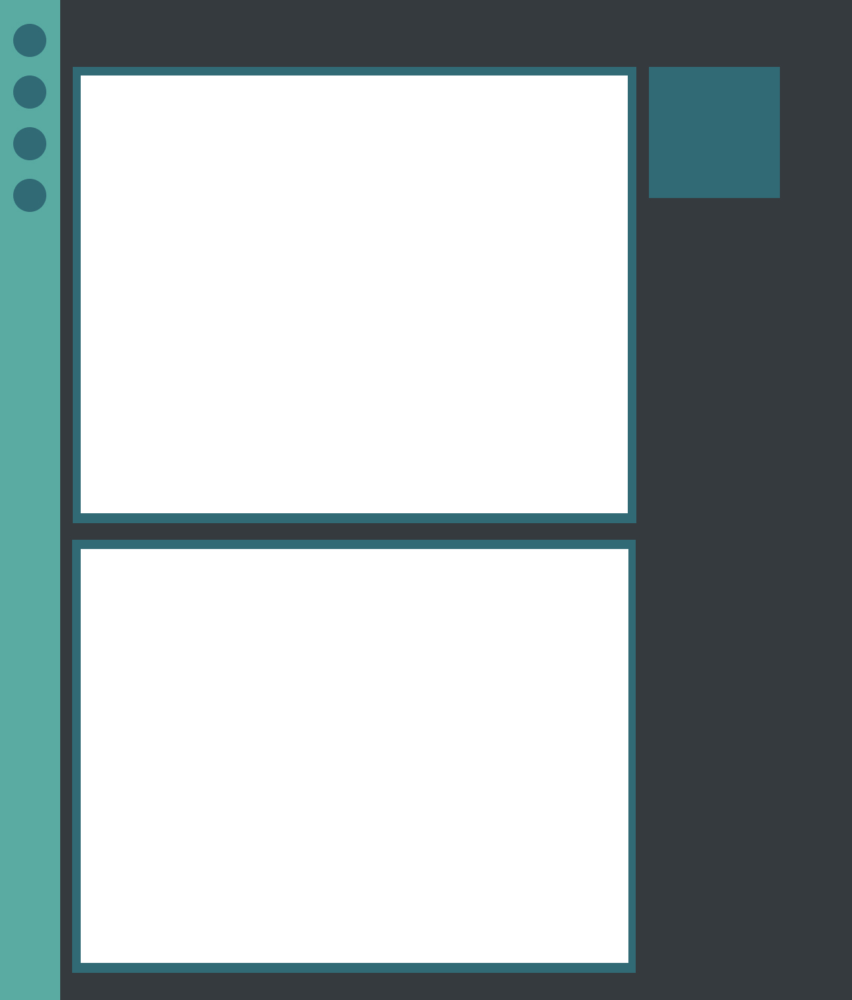

# Bloggin

This is a basic fullstack blog application made using Django and React.

## Table of Contents

- [General info](#general-info)
- [Technologies](#technologies)
- [Wireframe](#wireframe)
- [Layout Prototype](#layout-prototype)

## General info

This project exists to practice creating a backend REST API as well as a frontend app that consumes said API.

## Technologies

Backend:

- Python 3.9
- Django 3.2.5
- DjangoRESTFramework 3.12.4

## Wireframe

#### Home Page

#### Profile Page

#### Draft Page

## Layout Prototype

